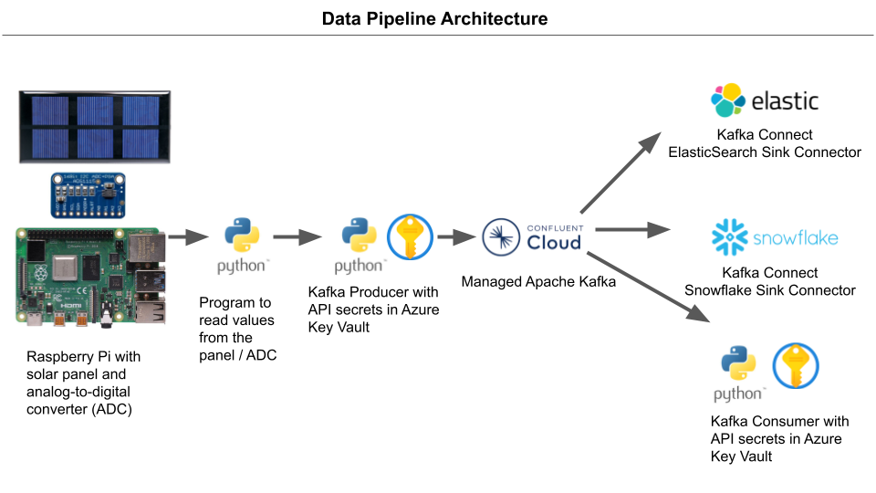
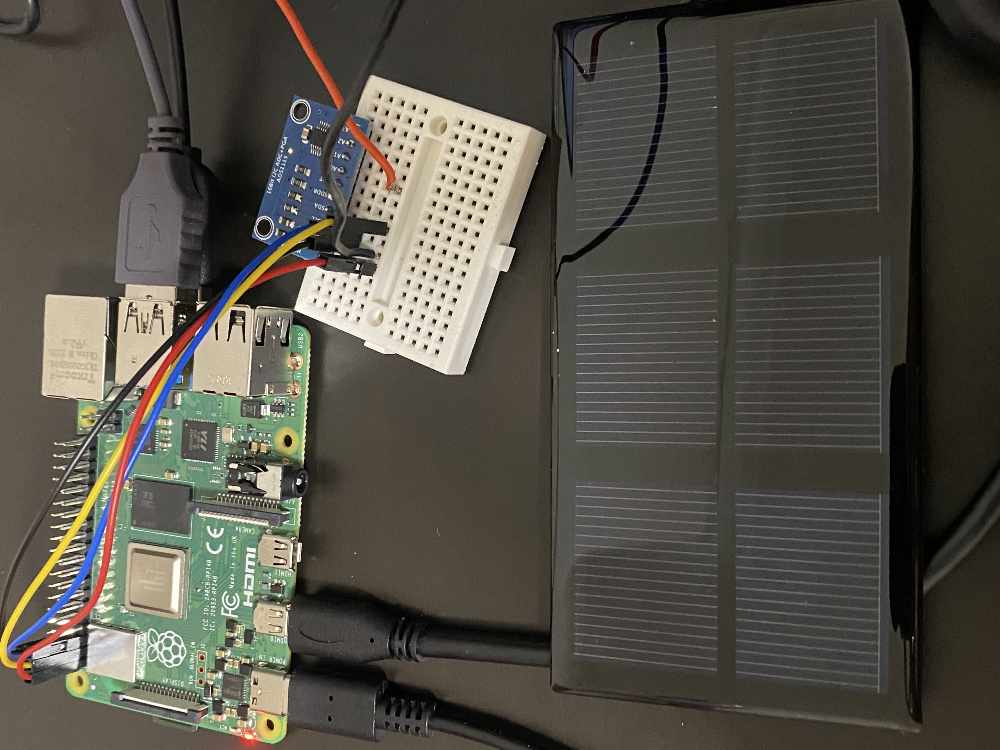
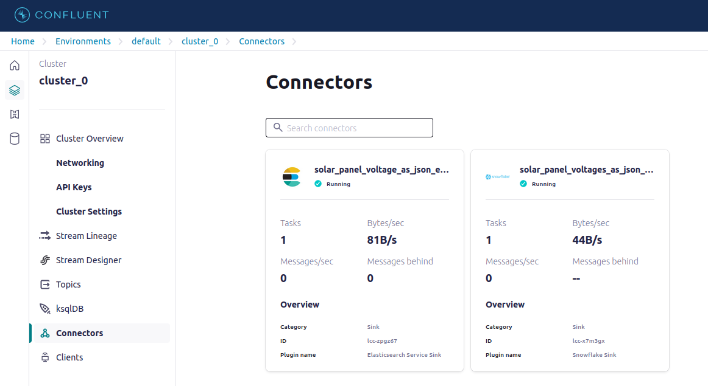

# Introduction

This project consists of a real-time streaming analytics data pipeline that uses a Raspberry Pi and Apache Kafka to send voltage readings from a mini solar panel to a managed Apache Kafka instance in the cloud (Confluent Cloud). From the cloud, the readings are then sent to a Kafka consumer (python script), while at the same time being sunk into ElasticSearch and Snowflake using Kafka Connect. Awesome!

# Pipeline Architecture

# Hardware Setup

This project uses the following components for hardware.

1. [A Raspberry Pi 4 Model B](https://www.altronics.com.au/p/z6302g-raspberry-pi-4-model-b-board-4gb/)
Note: You'll also need a monitor, mouse, and keyboard for the Raspberry Pi

2. [An ADS1115 analog-to-digital converter (ADC)](https://www.altronics.com.au/p/z6221-analog-to-digital-ADS1115-16-bit-converter-module/)

3. [The N0720 0.75W solar panel from Altronics](https://www.altronics.com.au/p/n0720-mini-0.75w-polycrystalline-solar-project-panel/)

4. A bread board

5. Other electronics hobby equipment: wires, solder, soldering iron, voltmeter, etc.

# Software Setup

This repo requires the following python libraries to be installed to run properly:

1. [confluent-kafka](https://pypi.org/project/confluent-kafka/)

    Note: If the confluent-kafka package doesn't work on the Raspberry Pi you may want to try the following library instead: [pup-confluent-kafka](https://pypi.org/project/pup-confluent-kafka/)

2. [Adafruit-ADS1x15](https://pypi.org/project/Adafruit-ADS1x15/) (for the ADS1115)

You will also need to add your own Kafka cluster configurations and authentication details to the scripts.

In addition, I am using two Kafka Connect connectors provided by Confluent Cloud:

1. ElasticSearch Service Sink

2. Snowflake Sink

JSON configuration files for these connectors are provided with this repo in the "Connector Configs" folder

# Acknowledgement

I would like to thank Sean Law for helping me learn about and configure the hardware side of this project - soldering, wiring, pinout configurations, etc. Thank you Sean!
